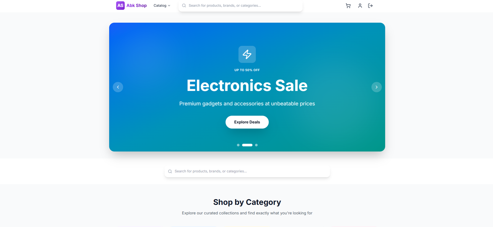
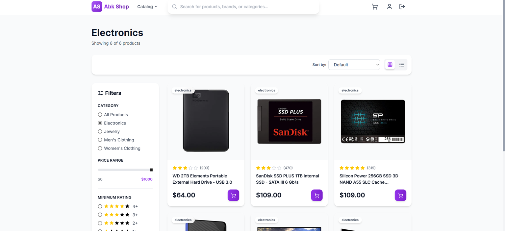
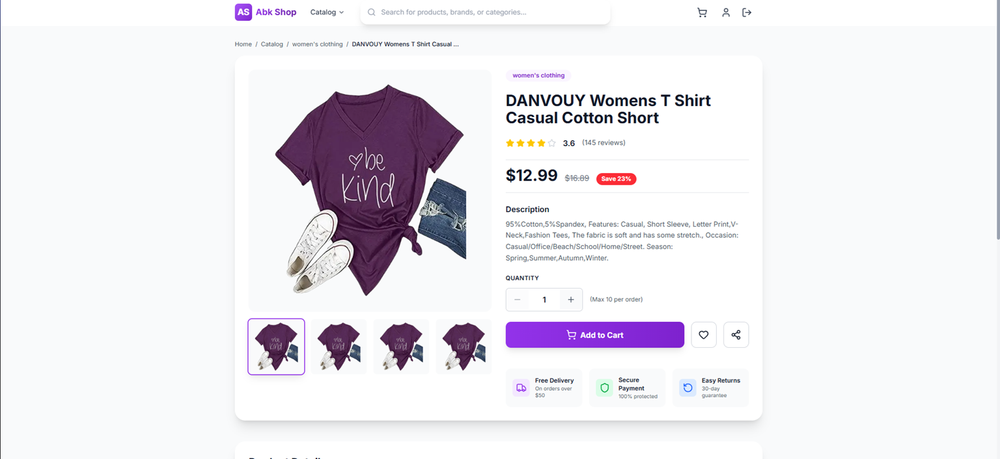
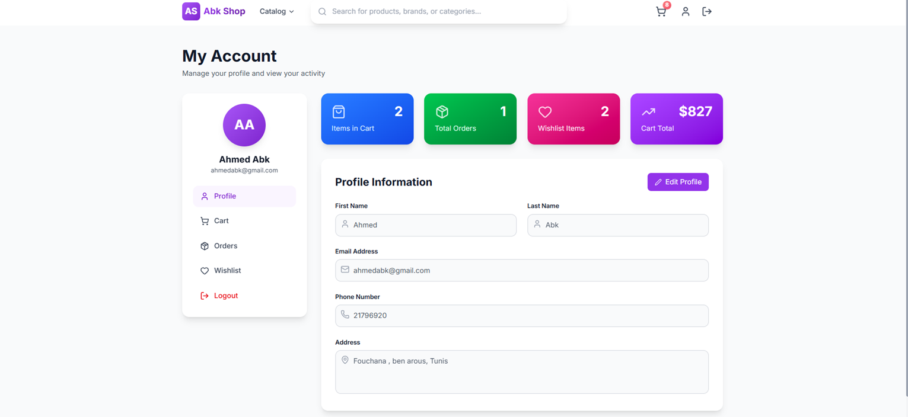
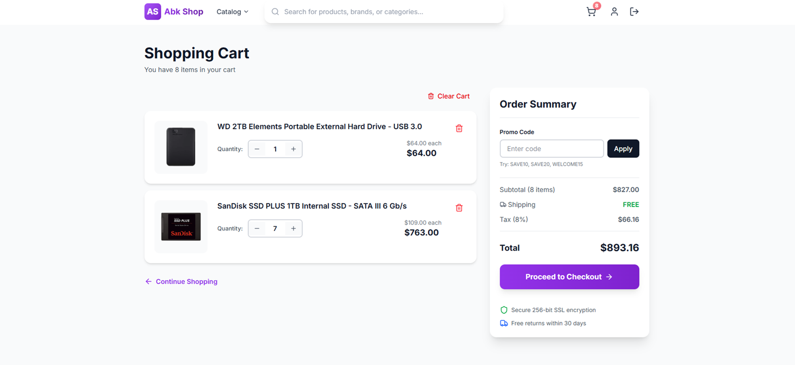
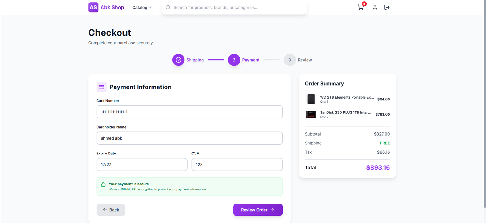
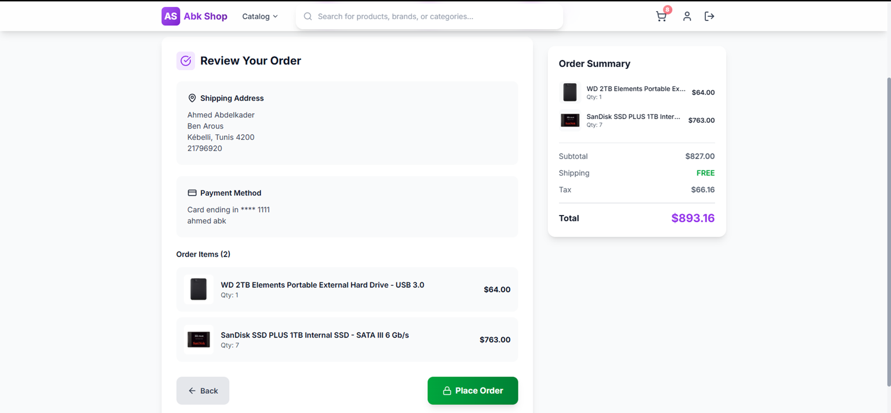

## Ecommerce App (Next.js + Redux Toolkit)

### Overview
This is a full‑featured ecommerce web application built with Next.js (App Router), React, and Redux Toolkit. It showcases modern UI/UX patterns, category browsing, product detail pages, a shopping cart, checkout flows, authentication pages, a user profile area, and a dedicated customer feedback page per product.

The app consumes the public Fake Store API for catalog data and demonstrates clean architecture, type‑safe data handling patterns (where applicable), reusable UI components, and an approachable developer experience.

### Key Features
- Product catalog with filtering, sorting, and pagination
- Product detail page with image gallery and rich product metadata
- Category browsing and “similar products” recommendations
- Add to cart, quantity management, and checkout scaffolding
- Wishlist/favorite interactions
- Authentication pages (login/register UI)
- Profile area with cart, orders, and wishlist subpages
- Dedicated feedback page per product with category‑specific review content
- Responsive design with accessible components

### Why These Technologies
- Next.js (App Router):
  - Server and client components, file‑system routing, and built‑in optimizations.
  - Image optimization via `next/image` for performance. 
  - Great developer ergonomics and ecosystem. 
- Redux Toolkit:
  - Opinionated, batteries‑included Redux with less boilerplate.
  - `createSlice` simplify async data fetching and state transitions.
  - Predictable state management for cart, product lists, and selections.
- Axios: Simple, promise‑based HTTP client with interceptors.
- Tailwind CSS:
  - Rapid styling with consistent design tokens.
- lucide‑react: Modern, lightweight icon set.
- react‑hot‑toast: Simple, accessible toast notifications.

### Data Source
- Products and categories are fetched from `https://fakestoreapi.com`.
  - Implemented in `src/lib/api.js` and consumed via Redux thunks in `src/store/slices/productsSlice.js`.

### Architecture and Project Structure
The codebase follows a clear separation of concerns and a feature‑first structure in critical areas.

```
src/
  app/
    layout.js                # Root layout (App Router)
    page.js                  # Landing page
    catalog/page.js          # Catalog with filtering/sorting/pagination
    product/[id]/page.js     # Product detail page
    product/[id]/feedback/   # Dedicated feedback page per product
      page.js
    cart/page.js             # Cart view
    checkout/page.js         # Checkout (scaffold)
    login/page.js            # Login UI
    register/page.js         # Register UI
    profile/                 # User area (scaffolded subpages)
      page.js
      cart/page.js
      orders/page.js
      wishlist/page.js

  components/
    Navbar.js                # Global navigation and search
    ProductCard.js           # Reusable product tile
    CategoryCards.js         # Category shortcuts (if present)

  store/
    slices/
      productsSlice.js       # Product list, categories, filters, selection
      cartSlice.js           # Cart state and operations

  lib/
    api.js                   # Axios instances and product endpoints

  app/globals.css            # Global styles (includes Tailwind directives)
```

#### Pages and Flows
- `Home (/ )`: Highlights featured or latest products with entry points into catalog.
- `Catalog (/catalog)`: Fetches products and supports:
  - Category filtering
  - Price range filtering
  - Rating threshold
  - Sorting (price, popularity, rating, newest)
  - Pagination
- `Product Detail (/product/[id])`:
  - Image gallery, rating, price, description, quantity selector, and actions (Add to cart, wishlist, share).
  - Related products (same category).
  - Reviews section replaced with a link to a dedicated feedback page.
- `Product Feedback (/product/[id]/feedback)`:
  - Displays two category‑specific reviews per product.
  - Breadcrumbs and back navigation to product page.
- `Cart (/cart)`: Shows items, prices, and quantities.
- `Checkout (/checkout)`: Placeholder to integrate payment and shipping.
- `Auth (/login, /register)`: UI scaffolds for authentication.
- `Profile (/profile)` and subpages: Scaffolds for orders, wishlist, and cart in user context.

#### State Management
- `productsSlice.js`:
  - `fetchAllProducts`, `fetchProductById`, `fetchCategories`, `fetchProductsByCategory` thunks.
  - Holds `items`, `selectedProduct`, `categories`, `filteredProducts`, and UI state such as `loading`/`error`.
- `cartSlice.js`:
  - Cart operations (add, remove, update quantity).
  - Derived totals/selectors can be added as the app grows.

#### API Layer
- `src/lib/api.js` creates an Axios instance for products and defines typed endpoints (getAll, getById, getByCategory, getCategories, etc.).
 
### Clean Code Practices
- Componentization:
  - UI is broken into small, reusable components (e.g., `ProductCard`, `Navbar`).
  - Pages orchestrate data fetching and compose components.
- Predictable Data Flow:
  - All product and cart state managed via Redux Toolkit slices and thunks.
- Separation of Concerns:
  - Network logic in `lib/api.js`, state in `store/slices`, presentation in `components/` and `app/` pages.
- Consistent Styling:
  - Tailwind utility classes promote consistent spacing, colors, and responsive behaviors.
- Readability:
  - Descriptive variable and function names, early returns, minimal deep nesting.
- Extensibility:
  - Category pages, product routes, and profile subpages are easy to extend or refactor.
 
### Security Considerations
- Client credentials are crypted.
- Axios error handling is centralized to avoid leaking raw errors.
- Future enhancements: authentication tokens, protected routes, server actions, and stricter CORS when moving to a custom API.

### Developer Guide

#### Prerequisites
- Node.js 18+ (recommend LTS)
- npm 9+ (or pnpm/yarn if you prefer; examples use npm)

#### 1) Clone and Install
```bash
git clone <your-repo-url> ecommerce-app
cd ecommerce-app
npm install
```

#### 2) Environment Variables
No secrets are required for the Fake Store API. If you later add private APIs, create a `.env.local` file and configure the Next.js runtime as needed.

#### 3) Run in Development
```bash
npm run dev //for starting the application
npm run api //for starting the json server
npm run dev:all //for starting both the application and json server
```
Then open `http://localhost:3000`.

#### 4) Build and Run Production
```bash
npm run build
npm run start
```

#### 5) Project Scripts (typical)
- `dev`: Start Next.js in development mode
- `build`: Create an optimized production build
- `start`: Start the production server (after build)

#### 6) Code Style
- Follow component and slice patterns already present.
- Prefer Redux Toolkit for state changes and async flows.
- Keep UI components presentation‑focused; move data ops to slices/thunks.
- Use Tailwind utilities for consistent styling; avoid ad‑hoc inline styles.

#### 7) Adding New Features
- New Page: create a new route under `src/app/.../page.js`.
- New Component: place in `src/components/` and import where needed.
- New Slice/Async Flow: add to `src/store/slices/`, export actions/selectors, and wire in your components.
- API: extend `src/lib/api.js` with typed endpoints; use thunks for side effects.

### Roadmap
- Real authentication and user accounts
- Real checkout with payments (Stripe, PayPal)
- Persistent wishlist and order history
- Review submission and moderation
- Improved accessibility audits and performance budgets


This is a [Next.js](https://nextjs.org) project bootstrapped with [`create-next-app`](https://github.com/vercel/next.js/tree/canary/packages/create-next-app).

## Getting Started

First, run npm install for installing node packaging and then for the development server:

```bash
npm run dev // or npm run dev:all 
# or
yarn run dev // or yarn run dev:all

```

Open [http://localhost:3000](http://localhost:3000) with your browser to see the result.

You can start editing the page by modifying `app/page.js`. The page auto-updates as you edit the file.

This project uses [`next/font`](https://nextjs.org/docs/app/building-your-application/optimizing/fonts) to automatically optimize and load [Geist](https://vercel.com/font), a new font family for Vercel.


## Screenshots

Below are screenshots showcasing the key features of the project. All images are stored in the `src/assets` folder.

### Main Page


### Catalog


### Product Detail


### Profile


### Cart


### Checkout Process
#### Checkout Step 1


#### Checkout Step 2


#### Checkout Step 3



## Learn More

To learn more about Next.js, take a look at the following resources:

- [Next.js Documentation](https://nextjs.org/docs) - learn about Next.js features and API.
- [Learn Next.js](https://nextjs.org/learn) - an interactive Next.js tutorial.

You can check out [the Next.js GitHub repository](https://github.com/vercel/next.js) - your feedback and contributions are welcome!

## Deployment on Vercel

This project is deployed on **Vercel**, a fast and reliable cloud platform for modern web applications.

🔗 **Live Demo:** [https://ecommercenextjs-eosin.vercel.app](https://ecommercenextjs-eosin.vercel.app)

